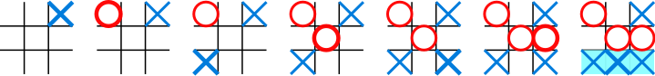

# Tic-Tac-Toe

## Project Description
Build a tic-tac-toe game on the command line where two human players can play against each other and the board is displayed in between turns.

## How to Play
Tic-tac-toe (American English), noughts and crosses (British English), or Xs and Os is a paper-and-pencil game for two players, X and O, who take turns marking the spaces in a 3×3 grid. The player who succeeds in placing three of their marks in a horizontal, vertical, or diagonal row is the winner.

The following example game is won by the first player, X:

**To play the game:**  
1. Download the repository onto your desktop.   
2. After downloading the respository onto your desktop start the game by running the file named "main" located in the bin folder  
3. Once the program is running on-screen text will be displayed guiding you through expected inputs. On-screen text displaying who's turn it is and also showing which positions are available to play according to the numbers on the board.  
4. To place your symbol onto the board you must input a number as shown as available on the board then hit enter.  
5. First player to get three of their symbols in succession in any manner as seen in the above image wins.

*A draw occurs if no player is able to match 3 symbols in succession*

## Authors: 
### Aaron
Aaron's Github Profile: https://github.com/Aaron-RN
### Michael
Michael's Github Profile: https://github.com/zhuchini

## Github Link
Github Link: https://github.com/Aaron-RN/Tic-Tac-Toe
